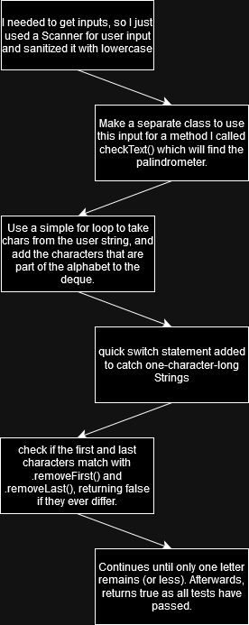

# **Palindrome Lab**
This lab consists of two classes; [Main](src/Main.java) and [Palindrometer](src/Palindrometer.java). The purpose of this lab is to effectively utilize the Deque class in managing collections.
# **Flowchart**

# **Challenges**
I hadn't used Deques before, so it took a little reading to figure it out. It's interesting how Deques simultaniously remove the data while we use it for a statement without serperately changing it.
