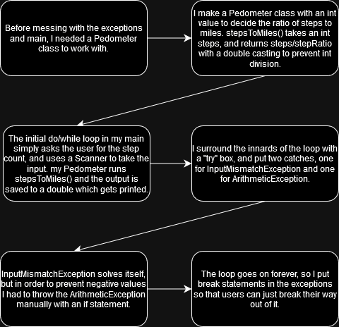

# **Pedometer Lab**
This lab consists of two classes; [Main](src/Main.java) and [Pedometer](src/Pedometer.java). The purpose of this lab is to show us how we can use try/catch and throws to deal with potential errors.
# **Flowchart**

# **Challenges**
The main challenge was figuring how to go about setting the messages for each exception. I initially didn't know I could make multiple catches, or how to manually throw, so I did some wacky solutions such as...
```
double n = 1/n+Math.abs(n)//forces an Arithmetic Error if n is negative
```
I'm glad I double checked the lecture.
