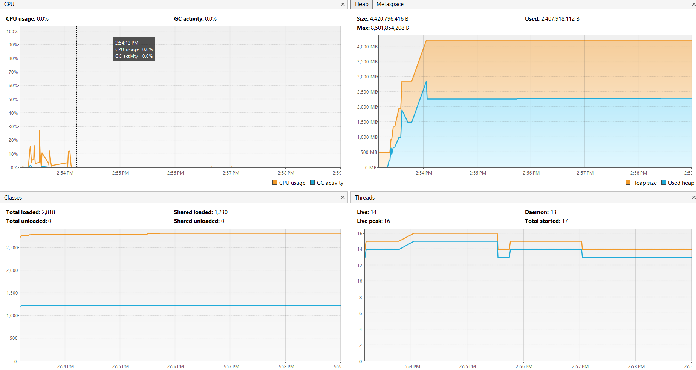
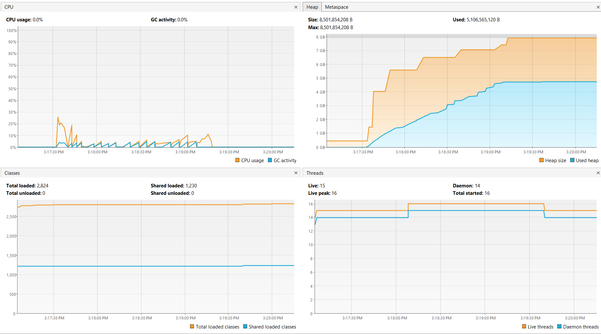
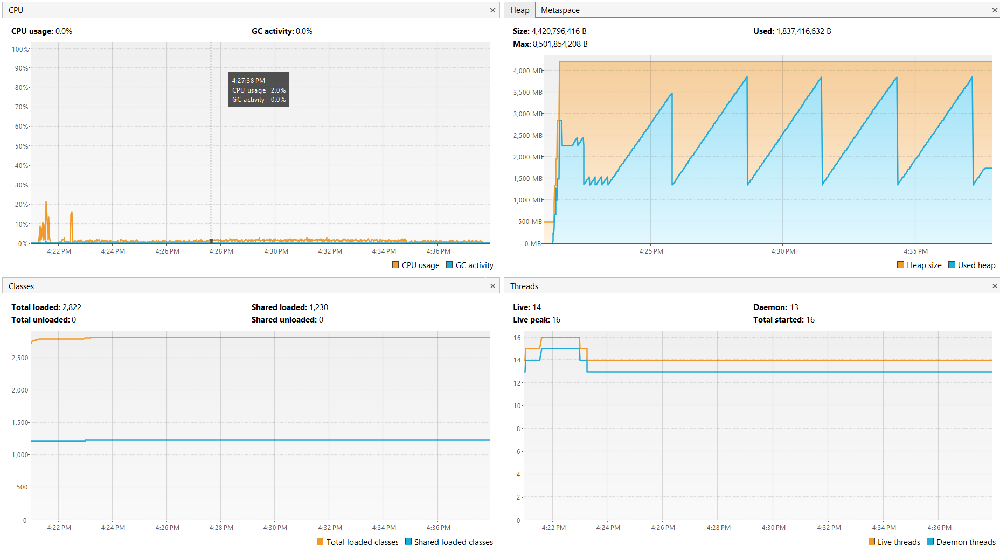
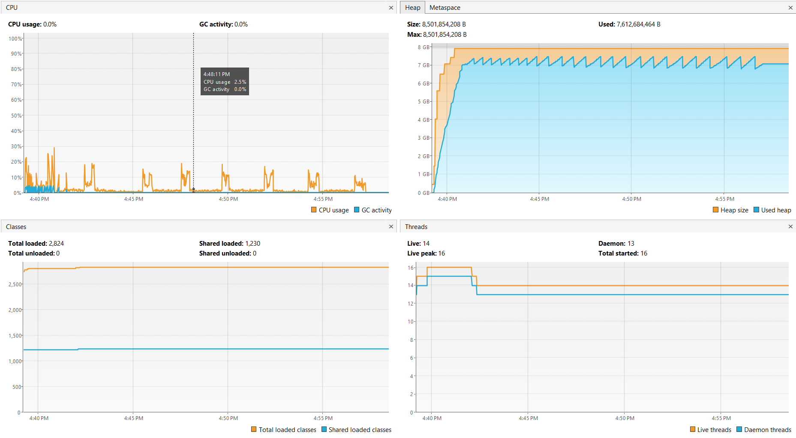

> [!NOTE]
> The assignment requests that my documentation shouldn't be longer than two pages, however this document may be over the limit given I have formatted this in a .md file. I will try to keep it brief as requested, though. 
# **HONORS - Performance Evaluation**
This assignment consists of two objectives, starting with making 100M, 200M, and 300M large ArrayLists and LinkedLists and comparing how they perform in various operations. The second part is comparing the performance between two iterators, one being a simple for loop with .get(i) taking care of all the values, and the other being a ListIterator set to go until hasNext() is false in a while loop.
# **Tools**
In order to generate my lists, I made a program which lets me make and control them. The program consists of two classes; [Main](src/Main.java) and [ErraticPulse](src/ErraticPulse.java). The names aren't relevant to their function, ErraticPulse is just a reference to a game I've played. 

To monitor the program, I used the software [VisualVM](https://visualvm.github.io/), which is a tool for profiling Java. While I'm quite new to this software (not to mention the 'profiling' tab not working for me) the monitoring tool is quite helpful. Aside from this monitoring tool, I'll mainly be using my own observations and timers to measure the differences.
# **Part A - Comparing ArrayLists and LinkedLists**
The first thing I did was comparing the efficiency of each list by seeing the response times given by removing/adding elements. From what I experienced, adding/removing from the end of either was effectively instant. However, the ArrayList would slow down when tasked to add or remove from the starting index. This disparity only got more noticable as I ramped up the size of the lists. This was tested on 100M and 200M both, I attempted to run 300M with both lists active, but it hit the heap limit and after some time waiting I figured it was going to try to load forever. When creating these lists seperately, the ArrayList was able to be generated much quicker than the LinkedList. It only took ~9 seconds to make a 100M long ArrayList whereas it took ~46 seconds for the LinkedList. The ArrayList did experience a notable delay, however, between 200M and 300M. The time went from ~17 seconds to generate to a whopping ~48 seconds, which leads me to believe that ArrayLists may struggle more as the number of elements increase. My notes showing all of the times I recorded can be found [here](performdata.txt). 

As for memory, the ArrayList was much more space-efficient, as shown with the 300M graphs below. Additional graphs can be found elsewhere in this folder, but for the sake of brevity some shall be omitted. The CPU usage looks quite different at first for these, but they actually seem to go for about the same time, considering that the graphs are using different time intervals for the x axis.
 

The ArrayList stabilizes at a bit over 2GB, but the LinkedList takes over double that amount, approaching 5GB. I notice that the ArrayList has an intense "spike" to it before it mellows out, while the LinkedList appears to gradually build up. However even at the apex of this spike, it can't compare to the LinkedList's massive 5GB usage.
# **Part B - Comparing the Loop Iterators**
When using for and while loops to read the list contents, I notice that both utilized a lot of memory, not to mention the time they took. The for loop went slightly faster than the while loop, becoming most notable as the elements increased. At 300M, the for loop took about 15 minutes and 37 seconds, whereas the while loop took 16 minutes and 24 seconds.

As shown in the graphs below, these loops used much more memory than their original lists.
 

The while loop with the LinkedList appears to consume even more memory than before (~5GB to ~7GB), but remains mostly stable, whereas the for loop with the ArrayList uses porportionally much more memory before cleaning itself up and doing it again. Confusingly, trying to create another 300M LinkedList caused it to reach 7GB before running the loop, which makes my initial ~5GB result a bit of an outlier. If ~7GB is taken to be the new baseline, then the while loop was much better at keeping memory usage consistent, albiet consistantly memory-intensive. The while loop also resulted in more CPU usage throughout the reading, whereas the for loop only really had notable percentages at the beginning.
# **Conclusion**
### Part A
ArrayLists are cheaper in terms of overall memory, albiet with poor loading times for the beginning of its array. They're a little bit quicker to construct, as well, though keep in mind that it took 100M entries to cause a ~24 second difference between the two. 
### Part B
While (heh) the while loop and ListIterator used up overall more memory and stressed the CPU more often, it did achieve a more consistent level of memory usage, with relatively smaller spikes being cleaned more regularly. The for loop which used `.get(i)` was also a bit quicker than the while loop. 
